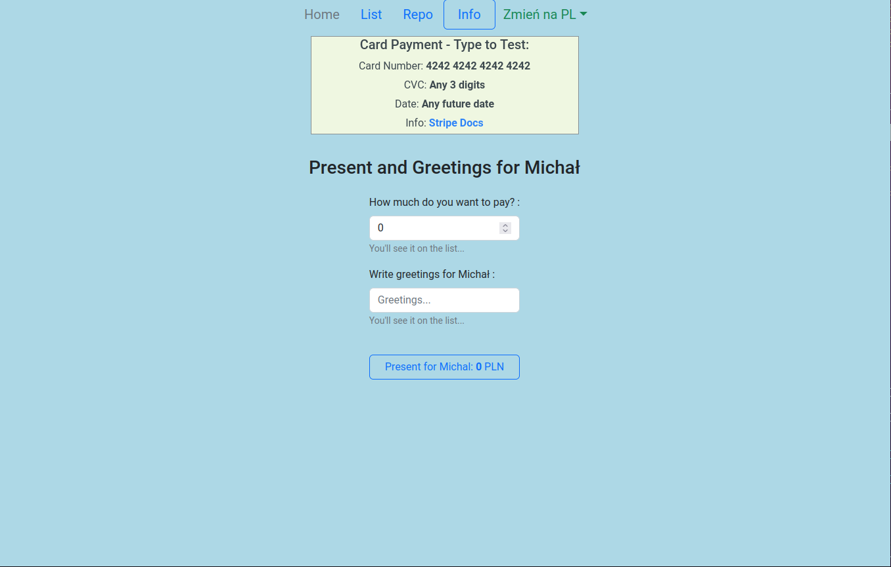

# MERN App with Stripe and Sendgrid

A MERN Stack App with Stripe and Sendgrid.

Link to the application: [https://mern-stripe-sengrid.herokuapp.com](https://mern-stripe-sengrid.herokuapp.com)

## Description

### Motivation

I wanted to build a [MERN stack](<https://wikitia.com/wiki/MERN_(solution_stack)>) application using
[Stripe](https://stripe.com) and [SendGrid](https://sendgrid.com) but something other than E-commerce and Chat-app.

### General Info

There are two inputs: the first input - for the amount, and the second one - for greetings. After clicking the Submit
button - the [Stripe](https://stripe.com) component is launched - for online card payments. The email is then sent
automatically by [SendGrid](https://sendgrid.com) (to the email address you provided during payment) and the information is
then stored in [MongoDB Atlas Database](https://www.mongodb.com). You can see all the greetings by clicking on the list. The
user interface is bilingual: Polish and English. Translations are handled by [i18next](https://www.i18next.com).

**_Payments are in test mode - type to test:_**\
Card Number: **4242 4242 4242 4242**\
CVC: **Any 3 digits**\
Date: **Any future date**\
More info on **[Stripe Docs](https://stripe.com/docs/testing?numbers-or-method-or-token=card-numbers)**.

## Notes

The keys are not hosted on the [GitHub.com](https://github.com).\
I have some packages installed globally (e.g. TypeScript, Nodemon) so you have to install them manually.

## ScreenShots

## Built With

- The App is written in [TypeScript](https://www.typescriptlang.org).
- [React Bootstrap](https://react-bootstrap.github.io) and [Sass](https://sass-lang.com) are used to customize the UI.
- Fetching data is done by using : [Axios](https://axios-http.com).
- Client-side routing is done using: [React Router](https://v5.reactrouter.com).
- Global state of the App is maintained by: [Redux](https://redux.js.org).
- [i18next](https://www.i18next.com) is used to handle translations.
- [React](https://reactjs.org) is used to build client-side.
- [Express](https://expressjs.com) is used to build server-side.
- [Mongoose](https://mongoosejs.com/) and [Typegoose](https://www.npmjs.com/package/@typegoose/typegoose) are use to handle
  [MongoDB Atlas Database](https://www.mongodb.com).

## External Providers

- Card payments are handled by: [Stripe](https://stripe.com).
- Sending emails is handled by: [SendGrid](https://sendgrid.com).
- The data is stored by: [MongoDB Atlas Database](https://www.mongodb.com).

## License

[MIT](https://choosealicense.com/licenses/mit)
